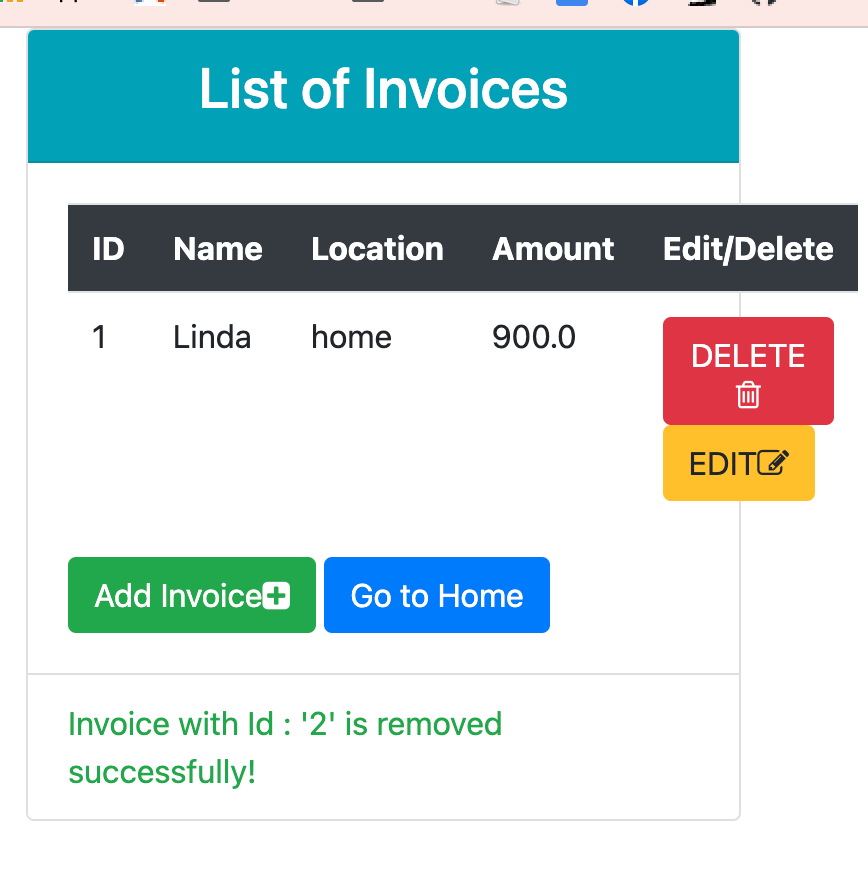

## About The App

[Promineo Tech Bootcamp](https://www.promineotech.com/) instructed Spring Boot with projects utilizing JDBC API connectivity. This succinct [tutorial](https://javatechonline.com/spring-boot-mvc-crud-example/) instruction utilizes JPA; I recommend for its: 
* explanation of key concepts, 
* visual project overview (screenshot of the final product and project structure map), 
* step by step instruction without code then with, and
* front end integration via [Thymeleaf]("https://www.thymeleaf.org/"), a popular template engine.

Note: I added a main App class to start Spring, not part of the tutorial. 
Another Note: Despite the clear instruction I missed a few things and needed to debug, a frustrating and ultimately satisfying learning experience.

## TODOs:
* Connect to localhost from the app
* Add responsiveness (see non-responsive bootstrap below)
* Swap Bootstrap for Material Design or something else? Message me with suggestions!

## Connect With Me!

[Twitter URL]: https://img.shields.io/badge/Twitter-1DA1F2?style=for-the-badge&logo=twitter&logoColor=white
[![Twitter][Twitter URL]](https://twitter.com/L_Forlizzi)

[linkedin-shield]: https://img.shields.io/badge/-LinkedIn-black.svg?style=for-the-badge&logo=linkedin&colorB=555
[![LinkedIn][linkedin-shield]](https://linkedin.com/in/linda-forlizzi)